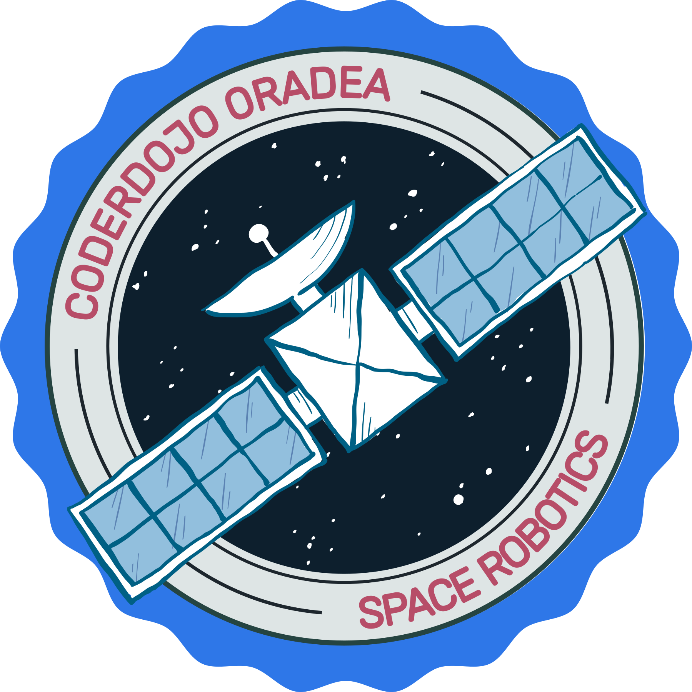

# CoderDojo Oradea Space Robotics



## Overview

Welcome to the CoderDojo Oradea Space Robotics project! This repository contains resources, code, and documentation for our space robotics program designed to introduce young minds to the exciting world of robotics with a focus on space exploration applications.

<p align="center">
  
  
  
</p>

## Table of Contents

- [About](#about)
- [Getting Started](#getting-started)
- [Project Structure](#project-structure)
- [Features](#features)
- [Technologies](#technologies)
- [Contributing](#contributing)
- [Community](#community)
- [License](#license)
- [Contact](#contact)

## About

CoderDojo Oradea Space Robotics is an educational initiative based in Oradea, Romania, that aims to inspire and educate young people about space science, programming, and satellite technology. Our program currently focuses on CanSat competitions - where teams design, build, and launch small satellite prototypes the size of a soda can that simulate real satellite missions.

### Our Mission

To empower the next generation of space engineers and scientists by providing hands-on experience with CanSat development, data collection, and analysis in an accessible, engaging, and collaborative environment.

### What is a CanSat?

A CanSat is a simulation of a real satellite integrated within the volume and shape of a soft drink can. The challenge for students is to fit all the major subsystems found in a satellite, such as power, sensors, and communications, into this minimal volume. The CanSat is then launched to an altitude of about one kilometer and deployed from a rocket, drone, or balloon, after which it carries out its mission as it descends back to Earth.

## Getting Started

### Prerequisites

- Basic understanding of programming concepts
- Familiarity with microcontrollers (helpful but not required):
  - Arduino
  - ESP32
  - STM32
  - Raspberry Pi
- Interest in electronics, sensors, and data collection
- Enthusiasm for learning about space technology and satellite missions!

### Joining Our Team

We have a selection process for new team members interested in participating in our CanSat competitions. However, anyone is welcome to:

- Follow our public repositories and progress
- Attend our public events and demonstrations
- Connect with us on social media for updates

If you're interested in becoming a team member:

1. Contact us through our social media channels or email
2. Inquire about upcoming selection periods
3. Prepare to showcase your interest and relevant skills

### Repository Access

Some of our repositories are private and accessible only to team members. If you're a team member:

```bash
# Clone our public CanSat2024 repository
git clone https://github.com/CoderDojoOradeaSpaceRobotics/CanSat2024.git

# For private repositories, you'll need to be added as a collaborator
# then you can clone them with:
git clone https://github.com/CoderDojoOradeaSpaceRobotics/CanSat2025.git
```

## Project Structure

Our organization hosts several repositories:

- **CanSat2024**: Our public repository for the 2024 CanSat competition (Python)
- **CanSat2025**: Our current competition repository (Python, Private)
- **Document-templates**: LaTeX templates for project documentation (TeX, Private)

## Features

- **CanSat Competitions**: Annual participation in national and international CanSat competitions
- **Python Development**: Building data collection and analysis software in Python
- **Hardware Engineering**: Design and assembly of satellite components and sensors
- **Documentation**: Creating comprehensive technical documentation using LaTeX templates
- **Team-based Learning**: Collaborative problem-solving in a supportive environment

## Technologies

### Hardware
- Microcontrollers: Arduino, ESP32, STM32, Raspberry Pi
- Sensors: Pressure, temperature, GPS, IMU, and more
- Communications: Radio frequency modules, LoRa
- Power: Battery management, solar panels

### Software
- Programming Languages: Python, C/C++
- Data Analysis: NumPy, Pandas, Matplotlib
- Documentation: LaTeX, Markdown
- Version Control: Git/GitHub

## Contributing

Our repositories are maintained exclusively by official team members. We do not accept external pull requests or contributions to our codebase.

If you're interested in our work:
- You can follow our public repositories
- Attend our public events and demonstrations
- Connect with us on social media for updates

For those interested in becoming official team members, please see the [Joining Our Team](#joining-our-team) section.

## Community

- Follow us on [X/Twitter](https://x.com/CoderDojoOradea) and [BlueSky](https://bsky.app/profile/coderdojooradea.bsky.social)
- Subscribe to our [YouTube Channel](https://www.youtube.com/@coderdojooradea5947)

## Achievements

- 🏆 Participated in the 2024 European CanSat Competition
- 🚀 Successfully designed, built, and launched multiple CanSat prototypes
- 🌟 Engaged local schools and communities in space science education

## License

This project is licensed under the MIT License - see the [LICENSE](LICENSE) file for details.

<p align="center">
  Made with ❤️ by CoderDojo Oradea
</p>
